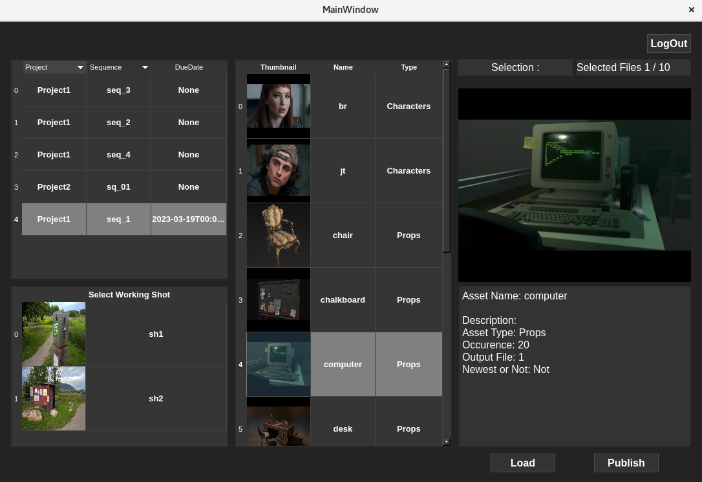

# README


# **Team Pizza**

Pizza is a Python API for layout artist dealing with maya.

# **API 다운로드 링크**

- SSH clone URL: **`ssh://git@git.jetbrains.space/pipeline/main/pizza.git`**
- HTTPS clone URL: **`https://git.jetbrains.space/pipeline/main/pizza.git`**

These instructions will get you a copy of the project up and running on your local machine for development and testing purposes.

## **Demo**


UI 전체 스크린샷

[//]: # ()
[//]: # (## **설치방법**)

[//]: # ()
[//]: # (Use the package manager [pip]&#40;https://pip.pypa.io/en/stable/&#41; to install Pizza.)

[//]: # ()
[//]: # (```)

[//]: # (pip install Pizza샷API)

[//]: # ()
[//]: # (```)

## **기본정보**

- 개발기간: 2023.01.30 ~ 03.17
- 개발방법: 오픈소스 공동개발 프로젝트
- 개발형태 : python2.7
- 개발도구: Gazu, Pyside2, Maya 2020
- 개발지원: Netflix Academy
- 권리자(발명자): Team Pizza (강경욱, 박정태, 이보름, 이의민, 조아현)

## **서버 권장 사항**

- OS: Linux

## **특 징**

- 로깅 & 로그인 설정 및 관리
- 작업에 필요한 파일 전반(camera/undistortion image/asset) 로드
- 작업 결과 파일 저장
- 작업한 샷의 프리뷰 영상 생성 및 저장

## **사용법**

1. menu bar → Pizza → API 실행 → Kitsu 로그인
    
    (자동로그인 선택 가능)
    
2. task 선택 (필요 시 샷으로 필터링 가능)
3. Maya Scene 파일 및 casting 되어 있는 asset data import
4. Maya에서 Load 및 Save 작업 진행
    
    (Scene, Preview 파일을 각각 올바른 폴더 트리에 맞춰 저장)
    
5. Kitsu에 작업 내역 퍼블리시

## **기타 라이브러리 및 명령어 설치**

Pizza에서 사용중인 라이브러리는 다음과 같습니다.

- os
- gazu
- pyside2
- shiboken2
- maya cmds
- Qt...

## **주의사항**

- 프로젝트의 전반적인 규칙, 공유되어야 할 내용이 적혀있습니다.
- python 2.7 에서 실행되는 API 입니다.
- save 및 load 도중에 강제 종료하지 마십시오.
- 파일명을 임의로 바꾸지 마십시오.

## **라이센스**

Team Pizza